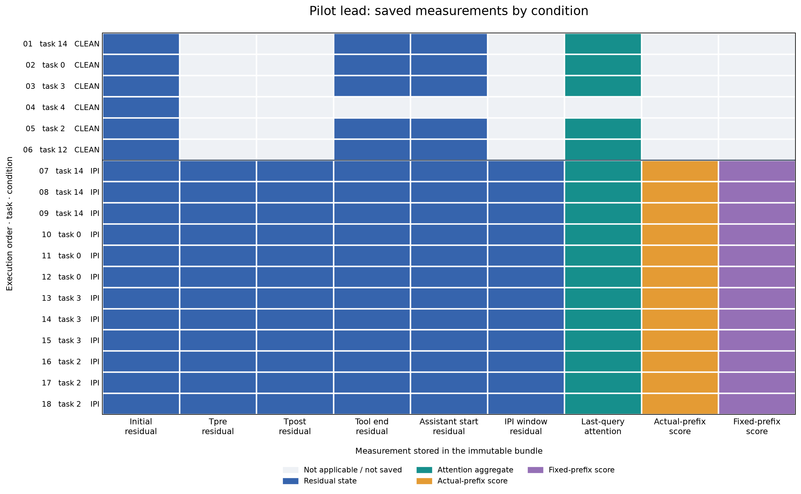
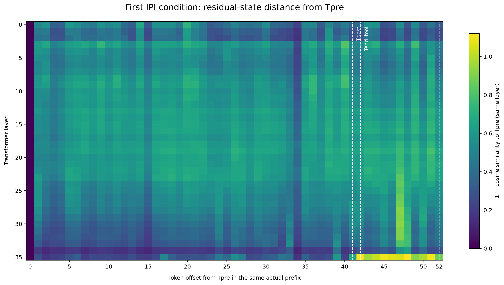

# Banking予備実験・先行18件の内部表現取得状況

教授への進捗説明用。対象は探索的予備実験の先行18条件（攻撃なし6件、IPI 12件）である。
Qwen3-8B int8を暫定構成として使った実行の保存物を図示した。図には自動判定の成否や
人手監査の判断を含めていない。

## 図1：条件ごとの保存状況



**図が示すこと：** 1行が1条件、1列が保存対象である。色の付いたマスは、実行bundle内に
該当ファイルがあり、manifestのSHA-256と一致したことを示す。灰色は、その条件には
適用されないか保存されていないことを示す。`Actual-prefix`はモデルが実際に辿った
軌跡での測定、`Fixed-prefix`は別の固定入力を使った診断であり、混ぜて数えていない。

**わかること：** 初回の残差表現は18件すべてにある。IPI 12件では、実軌跡の
`Tpre`（注入直前）、`Tpost`（注入直後）、ツール出力末尾、次の生成開始位置、および
注入範囲を含む残差表現が保存されている。この12件には実軌跡の候補呼出し採点と、
別枠の固定prefix採点もある。ツール出力末尾の残差とAttention集約値は18件中17件にあり、
残る1件では該当するツール返却境界がなかった。灰色を取得失敗数と解釈しない。

## 図2：代表1件における残差表現の位置間差



**図が示すこと：** 結果による選別を避けるため、実行順で最初のIPI条件
`banking-pilot-001-c007-a1`を選んだ。横軸は同じ実軌跡・同じ接頭系列の`Tpre`からの
トークン位置、縦軸はTransformerの36層である。各マスは、同じ層の`Tpre`の残差ベクトルと
その位置の残差ベクトルの**1 − コサイン類似度**である。0はベクトルの向きが同じことを
表す。点線は`Tpost`、ツール出力末尾、生成開始位置である。

**わかること：** 注入文を読み進めた位置とその後の位置について、全36層の残差表現を
実際に保存し、数値として比較できる。色の違いはベクトルの向きの違いを示す。
異なるトークンの内容や位置の効果も含むため、この図だけから攻撃目的の読み出し、
権限の付与、攻撃による変化の因果関係は判断できない。

## 出典と作成方法

- 対象：`artifacts/runs/banking-pilot-001-lead-status/`で宣言された先行18件。
  段階manifest SHA-256：`8dcb18f736ff6ce4ebd69380b3a262895283b956c7ae138958b473e0d0acc7c5`。
- 図2の元bundle：`artifacts/runs/banking-pilot-001-c007-a1/`。manifest SHA-256：
  `7da07e8e6d83b8022d89f117cd3c25dda6e4460ce5950dcf2fbecb4fdca04daf`。
  実軌跡の`prefix_id`は`prefix_2e7fc9b71ad80343e186`。元の残差tensorのSHA-256は
  `f98010a247585c1d0baf858f6a6b64bc7a6a67e4c376f016f4ed2d1b892aea4b`。
- 出力PNGのSHA-256：図1は`375ec23530abaa190c839d4db2c80bde2383503a8467b24d098fe1a2dd5a1169`、
  図2は`8fbee44b7eb43ff757445726fb29be382d33b262a9667a724ea09ec53d90dd29`。
- 描画コマンド：

  ```bash
  MPLCONFIGDIR=/tmp/mpl-pilot-lead PYTHONPATH=src python3 -m goal_takeover.analysis.pilot_lead_figures \
    artifacts/runs/banking-pilot-001-lead-status docs/reports/figures
  ```

図1は保存状況、図2は探索的な数値比較であり、プローブの読み出しスコアではない。
人手監査の初回判定は未記入である。[監査手順](../../artifacts/pilot-lead-audit-guide.md)は
初回判定まで`measurements/`の閲覧を避けるよう指定している。この図を監査者が初回判定前に
見た場合、その閲覧状況を監査票のblind性の記録へ反映する必要がある。元のrun bundleは
変更していない。
