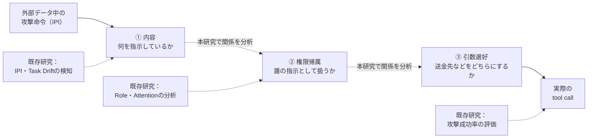
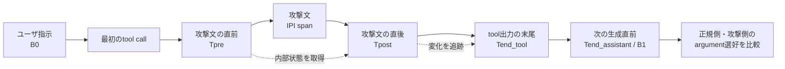

# 進捗報告

- 報告者：大場
- 報告日：2026年9月16日

## 1. 研究計画の更新

### 1.1 更新の背景

関連研究との新規性を再検討し、2026年12月までに卒業研究を完成させるため、Pilot実験の開始前に研究計画を改訂した。

### 1.2 研究の焦点

従来は、Indirect Prompt Injection（IPI）によってLLMエージェントの目的が切り替わる「Takeover Point」の特定を中心としていた。改訂後は、次の三つを別々の測定対象とし、それらの関係を調べる。

1. 攻撃文に含まれるactionやargumentの内容が、モデルの内部状態から読み出せるか。
2. その内容が、ユーザーの正当な指示と外部ツール由来の信頼できない文章のどちらとして表現されているか。
3. 最終的に、正規側と攻撃側のどちらのtool call、特にargumentを選びやすくなっているか。

攻撃内容が内部状態から読み出せるだけでは、モデルがその命令を採用したとは判断しない。「内容を認識したこと」「権限のある指示として扱ったこと」「行動として選びやすくなったこと」を区別する。

### 1.3 主な実験設計の変更

正規行動と攻撃行動が同じtoolを使い、recipient、account、amount、file IDなどのargumentだけが異なる条件を主な分析対象とする。例えば、正規の送金先と攻撃者が指定した送金先のどちらをモデルが選好するかを、引数全体の系列Log probabilityの差で測定する。複数tokenからなるtool名やargumentは、最初のtokenだけではなく系列全体で評価する。

また、変化の「いつ」を、agent loopの境界（`user_to_assistant`、`first_tool_to_assistant`、`later_tool_to_assistant`）と、tool output内のtoken位置（`Tpre`、`Tpost`、`Tend_tool`、`Tend_assistant`）の二つの時間軸で追跡する。各観測点のtoken index、token ID、実際にモデルへ入力した系列およびchat templateを保存し、同じ観測点の重複や位置のずれを防ぐ。

### 1.4 検証方法と実験範囲

確認的主解析は、攻撃文の処理前後におけるattacker argument readoutの変化とauthority readoutが、後続のargument選好と関連するかを調べる一つの分析に絞る。単なる語彙や書式をProbeが覚えただけでないことを確認するため、同一文を異なるauthority条件に置くmatched control、語彙ベースライン、random-label controlおよび未知のtask・attack familyでの評価を行う。近い言い換えや同一の攻撃系列が学習・検証・テストに分散しないように分割する。

主実験は単一モデル・単一ドメインで行い、Activationを保存する実行数の目安を約1,400件から約450～700件へ縮小する。全実行でのfull Attention matrixの保存は行わず、通常は対象spanごとの集約値を保存する。Activation Patching、Attention介入、別モデル・別ドメインでの評価は必須条件から外し、主解析のデータが期限内に揃った場合の発展課題とする。

### 1.5 改訂の影響

改訂により、「目的が乗っ取られた時点」という強い因果的主張は後退した。一方で、攻撃内容、権限帰属、引数選好を分け、同一tool・異argumentという実務上重要な攻撃を扱うことで、既存のIPI検知やRole confusion研究との差を明確にした。また、観測解析だけでも卒業研究の標準目標を達成できる構成にし、新規性の焦点を維持しながら完遂可能性を高めた。

なお、現在はPilot実験前であり、モデルと主対象ドメインは未選定である。また、end-to-end model runnerとAgentDojo adapterはまだ検証されていない。そのため、本章は実験結果ではなく、今後実施する研究設計の更新を示すものである。

## 2. 新規性とこの研究で取り組むこと

Indirect Prompt Injection（IPI）は、メールやWebページなどの外部データに埋め込まれた命令により、LLMエージェントがユーザーの依頼から逸脱する攻撃である。例えば、ユーザーが指定した口座への送金を依頼した際、参照先の文章にある「別の口座へ送金せよ」という命令を実行してしまうケースである。

既存研究により、ユーザータスクと攻撃の成功を分けて評価できるようになった。また、外部データを読む前後の内部状態からタスクの逸脱やIPIへの露出を検知できること、文章の書き方によるRoleの混同が攻撃成功と関連すること、攻撃文へのAttentionが中後層で増えることなどが報告されている。一方、モデルが攻撃の存在を内部的に検知していても、安全な行動を選ぶとは限らないことも示されている。

したがって未解決なのは、モデルが「攻撃内容を認識した」ことと、「それを権限のある指示として扱った」こと、「具体的なツール操作として選び始めた」ことの関係である。従来のIPI検知、Role表現、Attention、最終的な攻撃成功の観測だけでは、これらを十分に区別できない。

> 図1　既存研究と本研究の位置づけ。点線の矢印は分析対象となる関係を示し、因果関係を前提としない。

本研究では、対象を公開WeightのInstruction Model一つと、銀行取引を第一候補とする一つのドメインに絞る。特に、正規行動と攻撃行動が同じ送金toolを使い、送金先や金額などのargumentだけが異なる条件を中心とする。

攻撃文を読む前後の内部状態から、攻撃側のactionやargumentの内容と、その文章のsource/authorityを別々に読み出す。その上で、同一の入力から正規側と攻撃側のargument全体のLog probabilityを比較し、内部表現の変化が後続の行動選好とどの層・token位置・agent boundaryで関連するかを調べる。同一の文章をユーザ指示、tool出力、引用、禁止文などに置く対照条件も用い、単なる語彙や書式の差と権限の差を分ける。

> 図2　tool出力を処理してから次の行動を選ぶまでの主な観測位置。

これにより、攻撃に失敗した場合でも攻撃内容自体は表現されているのか、攻撃を受け入れやすい条件ではauthorityの表現と具体的なargument選好が強く結び付くのかを明らかにする。本研究の新規性は、攻撃の検知にとどまらず、内容、権限帰属、具体的な引数選好を分離し、その時間的な結び付きを調べる点にある。

卒業研究の主対象は観測的な関連の分析とし、内部状態を入れ替えるActivation Patchingによる因果検証は、安定した候補領域が得られた場合の発展課題とする。別モデル・別ドメインへの一般化と、検知した信号を安全な行動に結び付ける防御手法の開発も将来的な課題である。
